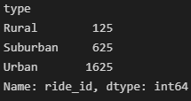
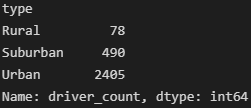

# PyBer_Analysis

Overview of the analysis

The purpose of this study was to analyze rideshare data in 120 cities by city type. The city types were divided into urban (66 cities), suburban (36), and rural (18) cities.

Results: Using images from the summary DataFrame and multiple-line chart, describe the differences in ride-sharing data among the different city types.

In the 120 cities, there were a total of 2,375 rides, categorized by cities as follows:

There were a total of 2,973 drivers, categorized by cities as follows:

It is apparent that with more drivers than total rides, many drivers did not make a single drive, particularly in the urban cities, where the driver count (2,405) exceeded the number of rides (1,625) by 48%.

Summary: Based on the results, provide three business recommendations to the CEO for addressing any disparities among the city types.
