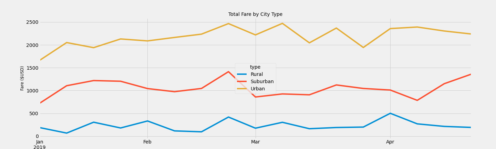

# PyBer_Analysis

# Overview of the analysis

The purpose of this study was to analyze rideshare data in 120 cities by city type. The city types were divided into urban (66 cities), suburban (36), and rural (18) cities.

# Results

Using images from the summary DataFrame and multiple-line chart, describe the differences in ride-sharing data among the different city types.

In the 120 cities, there were a total of 2,375 rides and 2,973 drivers. The table below lists lists the total rides and total drivers by city type, along with total fares collected, average fare per ride, and average fare per driver.

It is apparent that with more drivers than total rides, many drivers did not take a single ride, particularly in the urban cities, where the driver count (2,405) exceeded the number of rides (1,625) by 48%.

While there were considerably fewer drivers and rides in the rural cities, this is not a surprising result. Rural cities have smaller populations, yet farther distances to travel, so the average fare per ride would be greater. Surburban cities have more people than rural cities, yet a lower population density than urban cities, so average fares per ride and average fare per driver will fall in between the rural and urban cities.

In the more densely-populated urban cities, there are more people and distances to travel would be less, resulting in lower average fares. With more potential rides available, this would attract more drivers. However, due to the intense competition, many drivers would not be able to find rides and many drivers likely quit because they are earning little or no money.

This line graph shows the total weekly fare per week by city type over the first four months (Jan.-Apr.) of 2019:

For all city types, the graph was relatively flat over the four-month period, although there are some spikes where the total fare increased modestly for one week, then went back down to its previous level. Likely, this could be due to a special event occurring in the region during that week that increased traffic. This particularly was noticeable in late February when urban and suburban fares reached their highest totals, and the rural total fell just short of its high value over the period that was recorded in early April.

# Summary 

Based on the results, provide three business recommendations to the CEO for addressing any disparities among the city types.

* It is apparent from the data there are many drivers who are not taking a single ride, particularly in the urban cities. Thus, we should find ways to help drivers find more passengers so they can earn more money and are more likely to retain their driving services in the long run. Drivers who can't find riders and who can't earn money will likely become discouraged and will quit, so we should seek to reduce the number of discouraged and resigning drivers.

* We could study the potential of of increasing driving revenue from rural cities. While most people in urban cities are familiar with ride-sharing services and a high percentage of urban residents have used ride-sharing services at one time or another, such services are not as familiar nor as widely used among rural residents. We can thus seek ways to improve ride-sharing services in rural areas, where average fare per ride and average fare per driver are greater.

* Fare revenue does show some weekly variability over the four-month period analyzed, but four months less than 18 weeks. Thus, we should perform a trend analysis over a longer period of time, at least a minimum of one full year so we can cover every month and every season. During special events, holidays, and vacation periods, there is a greater demand for ride-sharing services and greater potential revenue to be earned. Thus, at these times we should have more drivers available for passengers so they can pick up more rides and earn higher total fares.
